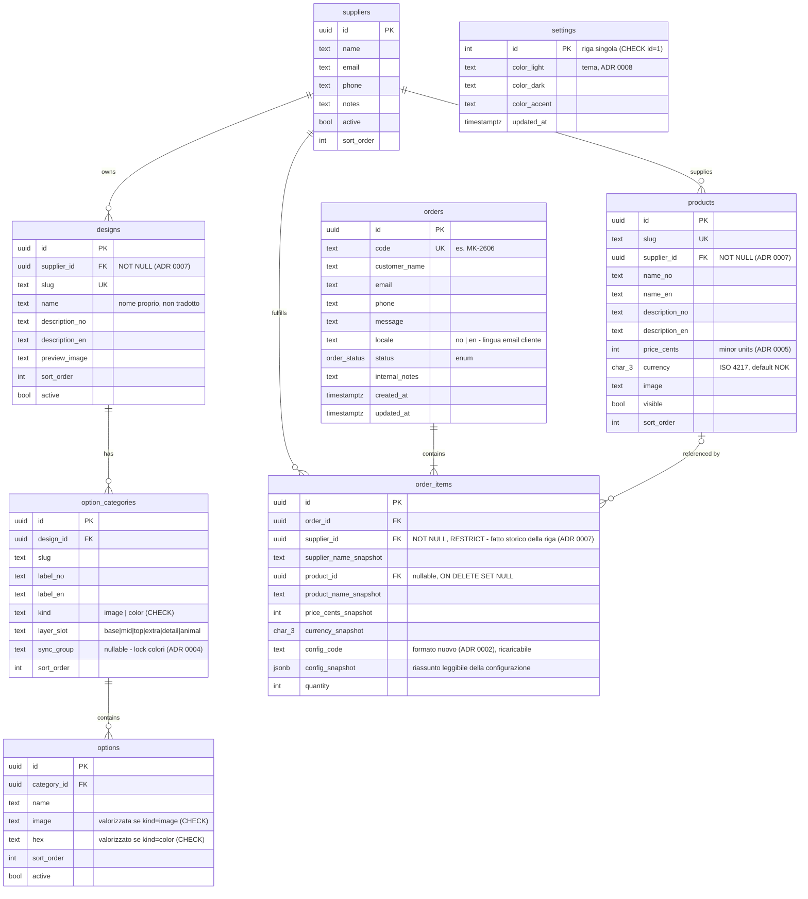

# Schema ER — minkeramikk.no

Diagramma del modello dati deciso in [ADR 0004](0004-modello-catalogo-unificato.md)
(catalogo unificato), [ADR 0005](0005-money-value-object.md) (Money) e
[ADR 0006](0006-suppliers-anagrafica-operativa.md) (suppliers).
Naming DB: **inglese**, snake_case (vedi convenzioni in `../../AGENTS.md`).
Questo file è la rappresentazione visiva: la fonte normativa restano gli ADR.

Enum `order_status`: `new → contacted → confirmed → in_production → delivered` (+ `cancelled`).

## Indici

| Indice | Motivo |
|---|---|
| `orders.code` UNIQUE | già implicito nel vincolo |
| `orders (status, created_at DESC)` | la query del back-office: "nuove, più recenti prima" |
| `order_items.order_id` | join ordine → righe |
| `order_items.config_code` | ricerca ordine da codice incollato (telefono col cliente) |
| `options.category_id` | join categoria → varianti |
| `option_categories.design_id` | join design → categorie |
| `products.supplier_id` | filtro step 3 del configuratore + back-office (ADR 0007) |
| `designs.supplier_id` | catalogo per fornitore (ADR 0007) |
| `order_items.supplier_id` | split PDF/email per laboratorio e filtro ordini per fornitore (ADR 0007) |
| `orders.email` | storico ordini dello stesso cliente nel back-office |

Vincoli aggiuntivi: `UNIQUE(design_id, slug)` su option_categories (slug di categoria
unici dentro il design, non globali).

Niente GIN su `config_snapshot`: nessuna query dentro il jsonb prevista.

## Semantica ON DELETE (esplicita, per la migration)

| FK | Regola | Razionale |
|---|---|---|
| `designs.supplier_id`, `products.supplier_id` | **RESTRICT** | NOT NULL: un fornitore con catalogo non si cancella — si disattiva (`suppliers.active=false`) |
| `order_items.product_id` | SET NULL (FK nullable) | gli ordini sono storia: sopravvivono al prodotto grazie agli snapshot |
| `order_items.order_id`, `options.category_id`, `option_categories.design_id` | CASCADE | i figli non hanno senso senza il padre |

## Note di lettura

- La configurazione di un item non ha FK verso designs/options: vive in `config_code`
  (ricaricabile nel configuratore) e `config_snapshot` (leggibile per sempre, anche se
  il catalogo cambia). Scelta deliberata: gli ordini sono storia immutabile, il catalogo no.
- `suppliers` non è mai esposto al pubblico: solo back-office (ADR 0006). La scelta del
  design aggancia il fornitore per l'articolo; carrello misto consentito; PDF d'ordine
  per laboratorio generato uno per fornitore (ADR 0007).
- `settings`: riga singola coi 3 token tema, lettura pubblica, scrittura authenticated (ADR 0008).
- RLS: catalogo in lettura pubblica (`active`/`visible`), scrittura authenticated;
  orders/order_items insert pubblico, lettura/modifica solo authenticated;
  suppliers solo authenticated.
