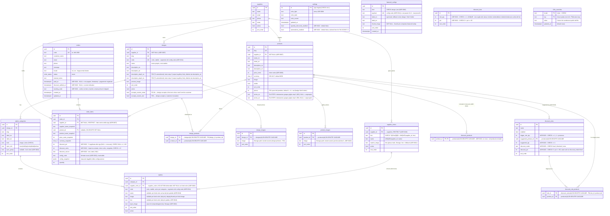

# Schema ER — minkeramikk.no

Diagramma del modello dati deciso in [ADR 0004](0004-modello-catalogo-unificato.md)
(catalogo unificato), [ADR 0005](0005-money-value-object.md) (Money) e
[ADR 0006](0006-suppliers-anagrafica-operativa.md) (suppliers).
Naming DB: **inglese**, snake_case (vedi convenzioni in `../../AGENTS.md`).
Questo file è la rappresentazione visiva: la fonte normativa restano gli ADR.

```mermaid
erDiagram
    suppliers ||--o{ designs : "owns"
    designs ||--o{ option_categories : "has"
    option_categories ||--o{ options : "contains"
    suppliers ||--o{ products : "supplies"
    suppliers ||--o{ order_items : "fulfills"
    orders ||--|{ order_items : "contains"
    products o|--o{ order_items : "referenced by"
    designs ||--o{ design_products : "whitelisted on"
    products ||--o{ design_products : "allows"
    designs ||--o{ design_images : "lifestyle photos"
    products ||--o{ product_images : "gallery photos"
    suppliers ||--o{ supplier_colors : "glaze palette"
    supplier_colors ||--o{ options : "colours (kind=color)"
    products ||--o{ discount_products : "included in discounts (ADR 0022)"
    discount_rules ||--o{ discount_rule_products : "trigger group"
    products ||--o{ discount_rule_products : "in a trigger group"
    products ||--o{ discount_rules : "suggested by (ADR 0023)"

    designs {
        uuid id PK
        uuid supplier_id FK "NOT NULL (ADR 0007)"
        text slug UK
        text code UK "corto, stabile - segmento del config code (ADR 0011)"
        text name "nome proprio, non tradotto"
        text description_no
        text description_en
        text description_step2_no "F36 (TL amendment): testo step 2 (sopra la gallery foto), distinto da description_no"
        text description_step2_en "F36 (TL amendment): testo step 2 (sopra la gallery foto), distinto da description_en"
        text preview_image
        int sort_order
        bool active
        bool accepts_custom_notes "R2-2b — design accepts a free-text colour note from the customer"
        bool accepts_custom_text "F38 — design accepts a customer inscription"
    }

    option_categories {
        uuid id PK
        uuid design_id FK
        text slug
        text label_no
        text label_en
        text kind "image | color (CHECK)"
        text layer_slot "base|mid|top|extra|detail|animal"
        text sync_group "nullable - lock colori (ADR 0004)"
        int sort_order
    }

    options {
        uuid id PK
        uuid category_id FK
        uuid supplier_color_id FK "→ supplier_colors, NO ACTION deferrable; NOT NULL se kind=color (ADR 0018)"
        text code "corto, stabile, unico per categoria - segmento del config code (ADR 0011)"
        text name "nullable: per kind=color arriva dal join palette (ADR 0018)"
        text image "nullable per kind=color (dal join); display/thumb per kind=image"
        text hex "nullable per kind=color (dal join palette, ADR 0018)"
        text layer_image "asset di compositing/preview, Storage (ADR 0010)"
        int sort_order
        bool active
    }

    supplier_colors {
        uuid id PK
        uuid supplier_id FK "→ suppliers, RESTRICT (ADR 0018)"
        text hex "CHECK ^#[0-9a-f]{6}$ - UNIQUE(supplier_id, hex)"
        text name "UNIQUE(supplier_id, name)"
        text swatch_image "foto glassa reale, Storage; hex = fallback (ADR 0012)"
        bool active
        int sort_order
    }

    suppliers {
        uuid id PK
        text name
        text email
        text phone
        text notes
        bool active
        int sort_order
    }

    settings {
        int id PK "riga singola (CHECK id=1)"
        text color_light "tema, ADR 0008"
        text color_dark
        text color_accent
        timestamptz updated_at
        bool quantity_discounts_enabled "ADR 0022 - default false"
        bool automations_enabled "ADR 0022 - default false, claimed here for R4-SCONTI ②"
    }

    featured_configs {
        uuid id PK
        text kind "CHECK design | set (ADR 0016)"
        text payload UK "config code (ADR 0011) o set param CA-3 - mai prezzi/id"
        text label_no "opzionale, fallback nome design / Sett N deler"
        text label_en
        text thumb_image "NOT NULL - thumb pre-composta featured/<id>.webp"
        int sort_order
        timestamptz created_at
    }

    products {
        uuid id PK
        text slug UK
        uuid supplier_id FK "NOT NULL (ADR 0007)"
        text name_no
        text name_en
        text description_no
        text description_en
        int price_cents "minor units (ADR 0005)"
        char_3 currency "ISO 4217, default NOK"
        text image
        bool visible
        int sort_order
        int pieces "F29: pezzi del prodotto, default 1; >1 = set (badge Sett N deler)"
        text series_no "R4-STEP3: intestazione gruppo griglia step 3 (NO). NULL = ungrouped"
        text series_en "R4-STEP3: intestazione gruppo griglia step 3 (EN). NULL = ungrouped"
    }

    design_products {
        uuid design_id FK "→ designs(id) ON DELETE CASCADE - PK(design_id, product_id)"
        uuid product_id FK "→ products(id) ON DELETE CASCADE"
    }

    design_images {
        uuid id PK
        uuid design_id FK "→ designs(id) ON DELETE CASCADE"
        text image "Storage path, bucket assets (design-photos/<slug>/<uuid>.<ext>, F26)"
        int sort_order
    }

    product_images {
        uuid id PK
        uuid product_id FK "→ products(id) ON DELETE CASCADE"
        text image "Storage path, bucket assets (product-photos/<slug>/<uuid>.<ext>, ADR 0020)"
        int sort_order
    }

    discount_tiers {
        uuid id PK
        int min_qty "ADR 0022 - CHECK >= 2, UNIQUE - due soglie allo stesso minimo renderebbero indeterministica la scelta del tier"
        int pct "ADR 0022 - CHECK 0 < pct <= 90"
        int sort_order
    }

    discount_products {
        uuid product_id PK,FK "→ products(id) ON DELETE CASCADE - ADR 0022, no rows = all products included"
    }

    discount_rules {
        uuid id PK
        text name
        bool enabled
        int trigger_min_qty "ADR 0023 - CHECK >= 1, 1 = presenza"
        uuid suggested_product_id FK "→ products(id) ON DELETE CASCADE"
        int suggested_qty "ADR 0023 - CHECK >= 1"
        text discount_mode "ADR 0023 - CHECK fixed | inherited | none"
        int discount_pct "ADR 0023 - CHECK 0 < pct <= 90, usato solo se discount_mode=fixed"
        int sort_order
    }

    discount_rule_products {
        uuid rule_id FK "→ discount_rules(id) ON DELETE CASCADE - PK(rule_id, product_id)"
        uuid product_id FK "→ products(id) ON DELETE CASCADE"
    }

    orders {
        uuid id PK
        text code UK "es. MK-2606"
        text customer_name
        text email
        text phone
        text message
        text locale "no | en - lingua email cliente"
        order_status status "enum"
        text internal_notes
        timestamptz paid_at "ADR 0021 - NULL = non pagato, timestamp = pagamento registrato"
        timestamptz discount_ratified_at "ADR 0022 - NULL = sconto indicativo"
        text tracking_code "ADR 0021 - codice corriere, inserito a mano prima di shipped"
        timestamptz created_at
        timestamptz updated_at
    }

    order_items {
        uuid id PK
        uuid order_id FK
        uuid supplier_id FK "NOT NULL, RESTRICT - fatto storico della riga (ADR 0007)"
        text supplier_name_snapshot
        uuid product_id FK "nullable, ON DELETE SET NULL"
        text product_name_snapshot
        int price_cents_snapshot
        char_3 currency_snapshot
        int discount_pct "ADR 0022 - % applicata alla riga (NULL = nessuna), CHECK NULL o 1..100"
        int discount_cents "ADR 0022 - importo scontato, minor units, congelato, CHECK >= 0"
        text discount_source "ADR 0022 - tier | deal | NULL"
        text config_code "formato nuovo (ADR 0002), ricaricabile"
        jsonb config_snapshot "riassunto leggibile della configurazione"
        int quantity
    }

    i18n_overrides {
        text locale PK "no|en - CHECK"
        text key PK "chiave piatta next-intl - PK(locale, key)"
        text value "il testo che sostituisce quello del file"
        timestamptz updated_at "default now()"
    }
```

Enum `order_status` (v2, ADR 0021): `new → confirmed → in_production → shipped → delivered`
(+ `cancelled` da qualsiasi stato). `shipped` aggiunto dalla migration 0030; `contacted` resta
nell'enum ma è **dormiente** — nascosto dall'applicazione, mai rimosso (un valore di enum
Postgres non si toglie in modo additivo).

## Indici

| Indice | Motivo |
|---|---|
| `orders.code` UNIQUE | già implicito nel vincolo |
| `orders (status, created_at DESC)` | la query del back-office: "nuove, più recenti prima" |
| `order_items.order_id` | join ordine → righe |
| `order_items.config_code` | ricerca ordine da codice incollato (telefono col cliente) |
| `options.category_id` | join categoria → varianti |
| `option_categories.design_id` | join design → categorie |
| `products.supplier_id` | filtro step 3 del configuratore + back-office (ADR 0007) |
| `designs.supplier_id` | catalogo per fornitore (ADR 0007) |
| `order_items.supplier_id` | split PDF/email per laboratorio e filtro ordini per fornitore (ADR 0007) |
| `orders.email` | storico ordini dello stesso cliente nel back-office |
| `featured_configs.sort_order` | la strip della home legge ordinata a ogni render (cache-ato, F28) |
| `design_products.product_id` | lookup inverso "quali design fissano questo prodotto" + cascade su delete prodotto (F34) |
| `design_images.design_id` | filmstrip step 2 del configuratore, ordinata per `sort_order` (F36) |
| `supplier_colors.supplier_id` | palette per fornitore (join step 2 + editor palette, ADR 0018) |
| `options (category_id, supplier_color_id)` UNIQUE WHERE supplier_color_id NOT NULL | un colore di palette al più una volta per categoria (ADR 0018) |
| `discount_rule_products.product_id` | lookup inverso "in quali regole è nel gruppo trigger questo prodotto" + cascade su delete prodotto (ADR 0023) |

Vincoli aggiuntivi: `UNIQUE(design_id, slug)` su option_categories (slug di categoria
unici dentro il design, non globali). `UNIQUE(designs.code)` e `UNIQUE(category_id, code)`
su options (codici del config code stabili e non ambigui, ADR 0011).
`UNIQUE(supplier_id, hex)` e `UNIQUE(supplier_id, name)` su supplier_colors (una glassa
per hex e per nome dentro il fornitore, ADR 0018).

`options` (ADR 0018, revisiona ADR 0012 in parte): la vecchia CHECK `image`/`hex` è
**rimossa**; il "modello a due vie" è ora imposto da trigger (`options_kind_shape`):
`kind=color` ⇒ `supplier_color_id` NOT NULL e stesso fornitore del design, con
`name/hex/image` NULL (arrivano dal join su `supplier_colors`); `kind=image` ⇒
`supplier_color_id` NULL e `image` NOT NULL. La foto-swatch reale + hex-fallback (ADR 0012)
resta, ma vive una volta sola nella palette invece che copiata per opzione.

Niente GIN su `config_snapshot`: nessuna query dentro il jsonb prevista.

## Semantica ON DELETE (esplicita, per la migration)

| FK | Regola | Razionale |
|---|---|---|
| `designs.supplier_id`, `products.supplier_id` | **RESTRICT** | NOT NULL: un fornitore con catalogo non si cancella — si disattiva (`suppliers.active=false`) |
| `order_items.product_id` | SET NULL (FK nullable) | gli ordini sono storia: sopravvivono al prodotto grazie agli snapshot |
| `order_items.order_id`, `options.category_id`, `option_categories.design_id` | CASCADE | i figli non hanno senso senza il padre |
| `design_products.design_id`, `design_products.product_id` | CASCADE (entrambi) | la restrizione non ha senso senza design o prodotto; gli ordini NON sono toccati (snapshot, F34/ADR 0017) |
| `design_images.design_id` | CASCADE | le foto non hanno senso senza il design (asset owned, F36) |
| `discount_products.product_id` | CASCADE | la riga di inclusione non ha senso senza il prodotto (ADR 0022) |
| `discount_rules.suggested_product_id` | CASCADE | una regola non ha senso senza il prodotto che suggerisce (ADR 0023) |
| `discount_rule_products.rule_id`, `discount_rule_products.product_id` | CASCADE (entrambi) | il gruppo trigger non ha senso senza la regola o il prodotto (ADR 0023) |
| `supplier_colors.supplier_id` | **RESTRICT** | una palette non si perde cancellando il fornitore — lo si disattiva |
| `options.supplier_color_id` | **NO ACTION** (DEFERRABLE INITIALLY IMMEDIATE) | un colore in uso non si cancella — si disattiva (check immediato di default = come RESTRICT); NO ACTION invece di RESTRICT perché RESTRICT non è deferibile, e la RPC `replace_supplier_colors` defera il vincolo per il replace atomico (delete+reinsert stesso id → check al commit), ADR 0018 / migration 0023 |

## Note di lettura

- La configurazione di un item non ha FK verso designs/options: vive in `config_code`
  (ricaricabile nel configuratore) e `config_snapshot` (leggibile per sempre, anche se
  il catalogo cambia). Scelta deliberata: gli ordini sono storia immutabile, il catalogo no.
- `suppliers`: il NOME è pubblico (id/name/active su righe attive — serve al badge del
  configuratore), i CONTATTI (email/phone/notes) sono solo authenticated (ADR 0009).
  La scelta del
  design aggancia il fornitore per l'articolo; carrello misto consentito; PDF d'ordine
  per laboratorio generato uno per fornitore (ADR 0007).
- `settings`: riga singola coi 3 token tema, lettura pubblica, scrittura authenticated (ADR 0008).
- `design_products` (F34, ADR 0017): whitelist **opzionale** design→prodotto. Nessuna riga
  per un design ⇒ tutti i prodotti visibili del suo fornitore (retro-compatibile, zero
  backfill). Righe ⇒ solo quelli, ∩ visibili. Stesso fornitore garantito da trigger
  (`design_products_same_supplier`) oltre che dall'app. Lettura pubblica (serve al
  configuratore anon), scrittura authenticated (pattern 0002_rls). Replace atomico via
  RPC `replace_design_products`. Estende ADR 0007 senza sostituirlo.
- `discount_tiers` / `discount_products` (ADR 0022): scala unica di soglie sconto
  quantità + inclusione prodotti, stessa convenzione "nessuna riga = tutti inclusi" di
  `design_products`. Lettura pubblica (il carrello calcola lato client), scrittura
  authenticated. Replace atomico via RPC `replace_discount_tiers` /
  `replace_discount_products`. Lo sconto effettivo è congelato su `order_items`
  (`discount_pct`/`discount_cents`/`discount_source`); la ratifica del negozio è
  `orders.discount_ratified_at`, gemello di `paid_at` (ADR 0021).
- `discount_rules` / `discount_rule_products` (ADR 0023, estende ADR 0022): fondamenta
  dati per le automazioni "chi ha X → suggerisci Y", con UI admin di authoring e
  logica di matching nel carrello spedite in questo ramo (v. ADR 0023 — Perimetro);
  nessuna colonna `deal_rule_id` su `order_items`, lo snapshot ordine congela solo
  `discount_pct`/`discount_cents`/`discount_source`. Il gruppo trigger è un
  multi-select di prodotti (`discount_rule_products`, PK composita `(rule_id,
  product_id)`, stessa forma di `design_products`), mai una serie. Tre modalità di
  sconto sul prodotto suggerito (`discount_mode`: `fixed` indipendente dai tier |
  `inherited` dal tier corrente | `none`); `discount_pct` vale solo per `fixed`.
  Lettura pubblica (il carrello legge le regole lato client), scrittura
  authenticated. Replace atomico del gruppo trigger via RPC
  `replace_discount_rule_products`, scoped by `rule_id` (nessun problema
  pg_safeupdate SQLSTATE 21000 — cf. migration 0033).
- `design_images` (F36, ADR 0019): galleria di foto lifestyle per design (filmstrip
  step 2). Nessuna colonna `active` → tutte le righe sono lette dal pubblico, ordinate
  per `sort_order`. Asset owned in Storage sotto `design-photos/<slug>/<uuid>.<ext>`
  (classe F26, 1024w). Niente lightbox in v1. Lettura pubblica, scrittura authenticated
  (pattern 0002_rls). CASCADE su delete design.
- `supplier_colors` (F35, ADR 0018): palette glasse **per fornitore** — nome/hex/swatch
  vivono una volta sola. Le opzioni `kind=color` puntano a una riga via `supplier_color_id`
  (niente più name/hex/image copiati: arrivano dal join). Forma a due vie + stesso
  fornitore garantiti dal trigger `options_kind_shape`. Lettura pubblica (l'anon risolve
  nome/hex/swatch nel configuratore), scrittura authenticated. Replace atomico via RPC
  `replace_supplier_colors` (FK deferita per il ciclo delete+reinsert). Revisiona in parte
  ADR 0012: il principio "swatch reale + hex fallback" resta, cambia solo *dove* vive.
- RLS: catalogo in lettura pubblica (`active`/`visible`), scrittura authenticated;
  orders/order_items insert pubblico, lettura/modifica solo authenticated;
  suppliers: campi safe (id/name/active) leggibili da anon su righe attive,
  contatti solo authenticated (ADR 0009).
- `i18n_overrides` (ADR 0026, R4-I18N): deviazioni ai testi di
  `src/i18n/messages/{no,en}.json`, scritte dal back office. Tabella **senza relazioni**: non
  ha FK verso nulla perché la lista delle chiavi valide vive nei file del repo, non nel DB.
  Riga assente = vale il file, in ogni scenario di errore compreso «migration non applicata».
  Lettura pubblica (il merge gira nel render pubblico con il client anon, come i token del
  tema), scrittura authenticated. La parità NO/EN non è un vincolo SQL: la garantiscono i file
  e `src/i18n/messages.test.ts`, e la server action scrive le due lingue in un solo upsert.
